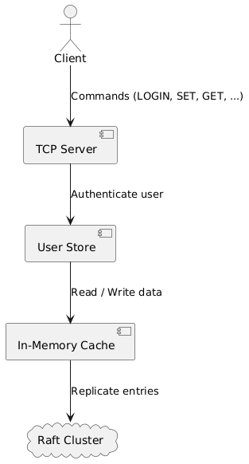
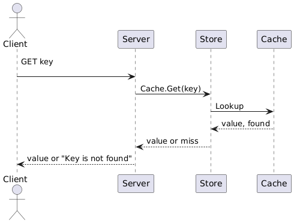
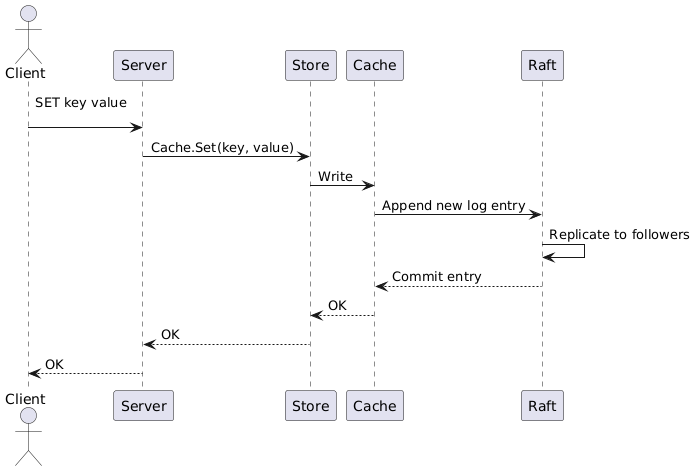
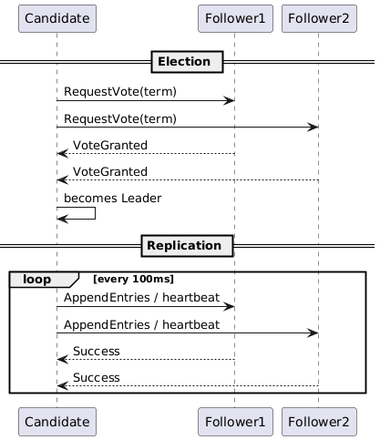

# Distributed Key-Value Cache — System Design

This document explains how the cache service works. It shows the main parts, the data flow, and how the nodes stay in sync.

---

## 1. High-Level View



* The **TCP server** listens on port 8080 and speaks a simple text protocol.
* Each user owns a **store** object that holds the password and its cache.
* The **cache** is a thread-safe map guarded by read–write locks.
* A **Raft cluster** keeps many nodes consistent. Each node runs a `RaftNode` instance.

---

## 2. Component Details

### 2.1 TCP Server

* Opens a listener and accepts many connections.
* Handles `LOGIN` and `SIGNUP` before any cache command.
* Parses `GET`, `SET`, `HAS`, and `DELETE` lines and forwards them to the right store.

### 2.2 User Store

* Binds a user name, a password, and a cache.
* Verifies the password on every login.

### 2.3 In-Memory Cache

* Uses a `map[string]string` plus a `sync.RWMutex`.
* Exposes `Set`, `Get`, `Has`, and `Delete` methods.
* Calls return quickly because all data lives in memory.

### 2.4 Raft Layer

* Elects one leader at a time with randomized timeouts.
* The leader ships log entries to followers on a heartbeat.
* Log entries hold cache commands, ensuring every node applies them in order.

---

## 3. Read Path



The server never waits on the cluster for reads because every node keeps a local copy after replication.

---

## 4. Write Path



A write is successful only after a majority of nodes store the entry. This guarantees durability under node loss.

## 5. Raft Consensus Walkthrough



* A node that times out becomes **Candidate** and requests votes.
* Majority votes make it **Leader**; it issues heartbeats to keep control.
* Writes travel inside **AppendEntries**; followers store and confirm.
* Once a majority stores an entry, the leader marks it committed and informs others in the next heartbeat.

---

## 6. Failure Handling

* A crashed follower replays the leader log on restart.
* If the leader fails, a new election starts after a timeout. The node with the freshest log wins.
* Clients can reconnect to any node; each node forwards writes to the current leader.

---

## 7. Build and Run

```bash
# Build
cd cider
go mod tidy
go run ./main.go
```

The server now listens on `localhost:8080`.

---

## 8. Example Session

```text
$ nc localhost 8080
LOGIN or SIGNUP
SIGNUP
Enter username: alice
Enter password: secret
User created successfully
SET foo bar
OK
GET foo
bar
```

---

