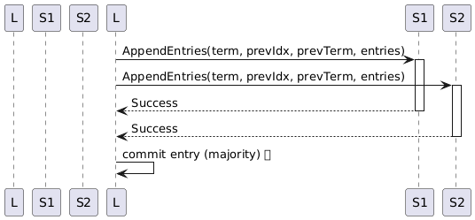

## 1. Raft in a Nutshell

Raft is a _consensus_ protocol.  It lets a cluster of unreliable machines act as **one** reliable state machine.  The core ideas are:

1. **Leader election** – at any moment one node is the leader; all others are followers.  
2. **Log replication** – every change is a log entry that must reach a majority before it is _committed_.  
3. **State machine safety** – once an entry is committed, every correct node will eventually apply it in the same order.

A node moves through three states:

| State      | When it is active                                |
| ---------- | ------------------------------------------------ |
| **Follower**  | Normal, quiet state; responds to leaders and candidates |
| **Candidate** | Starts an election when it times-out without hearing a leader |
| **Leader**    | Handles client commands and replicates log entries |

### 1.1 State&nbsp;Machine at a Glance
A follower can time-out, become a candidate, and—if it gains a majority—upgrade to leader. Any node that sees a higher term steps back to follower.


### 1.2 Leader Election
When a follower’s election timer fires it starts an election by sending `RequestVote` RPCs. If it gathers votes from a majority, it begins its reign as leader.


### 1.3 Log Replication
The leader packages client commands into log entries and floods them to followers using `AppendEntries` messages. Once an entry sits on > 50 % of the nodes it is **committed** and applied.



---

## 2. Source Walkthrough
The Raft code lives in [`cider/raft`](./raft/).  Each file matches one concept in the protocol.

| File           | What it holds                                                                            |
| -------------- | ---------------------------------------------------------------------------------------- |
| `types.go`     | Node state (`Follower`, `Candidate`, `Leader`), in-memory log, and the `RaftNode` struct |
| `rpc.go`       | RPC argument / reply structs and server methods (`RequestVote`, `AppendEntries`)         |
| `node.go`      | The control logic: time-outs, elections, heart-beats, and log replication                |

Below is a step-by-step map from the Raft paper to the Cider code.

### 2.1 Starting a Node – `NewRaftNode`
```go
node := &RaftNode{
    State: Follower,
    Log:   []LogEntry{{Term: 0}}, // genesis entry
}
```
*Every node begins life as a follower with an empty (genesis) log.*

### 2.2 Leader Election – `startElection` (node.go)
1. Promote self to **Candidate**.  
2. Increment `CurrentTerm` and vote for self.  
3. Send `RequestVote` RPC to every peer.  
4. On majority → become **Leader** and start the heart-beat ticker.

Corresponding code:
```go
n.State = Candidate
n.CurrentTerm++
// ... send RPCs
if votes > len(n.Peers)/2 {
    n.State = Leader
    n.StartHeartbeat()
}
```

### 2.3 Heart-Beats & Log Replication – `sendHeartbeat`
* Called every 100 ms by the leader.  
* Wraps new log entries into an `AppendEntriesArgs` (the _heart-beat_ doubles as a replication message).  
* Retries until every follower catches up.

### 2.4 Safety Checks – `RequestVote` & `AppendEntries` (rpc.go)
Both server methods begin with **term comparisons**:
```go
if args.Term < n.CurrentTerm { reject }
if args.Term > n.CurrentTerm { step-down }
```
These protect the cluster from stale leaders.

### 2.5 Commit Index Advancement – inside `sendHeartbeat`
After every successful replication the leader updates `MatchIndex[peer]`.  
When a log index is stored on a **majority**, it bumps `CommitIndex`, which in turn lets the application layer apply the entry.

---

## 3. How to Run a Local Cluster
```bash
# In three separate terminals
ADDR=:9001 go run main.go
ADDR=:9002 go run main.go
ADDR=:9003 go run main.go
```
Each instance reads the `PEERS` env-var (comma-separated `host:port`) to discover the rest.  _Example_: `PEERS=localhost:9001,localhost:9002,localhost:9003`.

Use `curl` or `nc` to send commands to the **leader**; followers will forward them automatically.

---

## 4. Further Reading
* The original Raft paper – _“In Search of an Understandable Consensus Algorithm”_.  
* The free Raft visualisation at <https://raft.github.io/raftscope/>.
